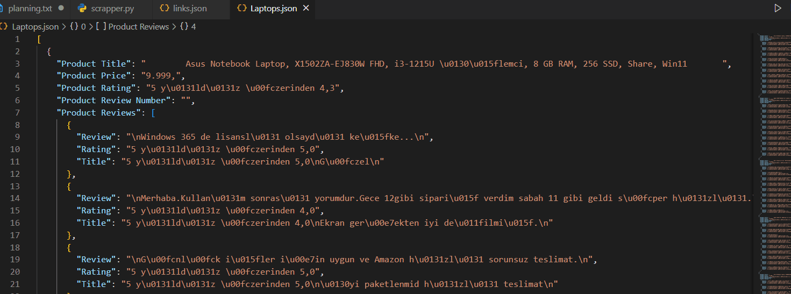

# AmazonCommentsWebScrapper

### In this project, I have created a web scrapper that scrapes comments of a product from Amazon. The comments are stored in a JSON file. Project uses BeautifulSoup library to scrape the comments from Amazon website

# Get the category link, paste it into links.json file

# Run the code

# Result

